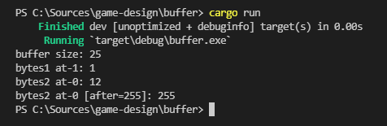

### Simple, thread safe, buffer allocator in Rust

```rust
fn main() {
    let mut bytes: [u8; 16384] = [0; 16384];
    for n in 0..bytes.len() {
        bytes[n] = (n % 255) as u8;
    }

    let memory = Buffer::init_from_bytes(&mut bytes);
    println!("buffer size: {}", memory.len());

    let bytes1 = memory.alloc(12);
    if let Some(bytes1) = bytes1 {
        println!("bytes1 at-1: {}", bytes1[1]);
    }

    let bytes2 = memory.alloc(10);
    if let Some(bytes2) = bytes2 {
        println!("bytes2 at-0: {}", bytes2[0]);
        bytes2[0] = 255;
        println!("bytes2 at-0 [after=255]: {}", bytes2[0]);
    }
}
```


